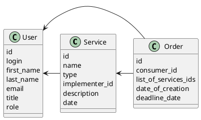

# Компонентная архитектура
<!-- Состав и взаимосвязи компонентов системы между собой и внешними системами с указанием протоколов, ключевые технологии, используемые для реализации компонентов.
Диаграмма контейнеров C4 и текстовое описание. 
-->
## Компонентная диаграмма

```plantuml
@startuml
!include https://raw.githubusercontent.com/plantuml-stdlib/C4-PlantUML/master/C4_Container.puml

AddElementTag("microService", $shape=EightSidedShape(), $bgColor="CornflowerBlue", $fontColor="white", $legendText="microservice")
AddElementTag("storage", $shape=RoundedBoxShape(), $bgColor="lightSkyBlue", $fontColor="white")

Person(user, "Пользователь")

System_Ext(ios_app, "Клиентское iOS приложение", "Swift", "Нативное iOS приложение")

System_Boundary(conference_site, "Платформа предоставления услуг") {
  '  Container(ios_app, "Клиентскj", ")
   Container(users_service, "Сервис авторизации", "C++", "Сервис управления пользователями", $tags = "microService")    
   Container(services_service, "Сервис услуг", "C++", "Сервис управления услугами", $tags = "microService") 
   Container(orders_service, "Сервис заказов", "C++", "Сервис управления заказами", $tags = "microService")   
   ContainerDb(db, "База данных", "MySQL", "Хранение данных о услугах, заказах и пользователях", $tags = "storage")
   
}

Rel(user, ios_app, "Регистрация/авторизация, просмотр доступных услуг, создание заказа, добавление услуг в заказ, создание услуги")

Rel(ios_app, users_service, "Работа с пользователями", "localhost/users")
Rel(users_service, db, "INSERT/SELECT/UPDATE", "SQL")

Rel(ios_app, services_service, "Работа с услугами", "localhost/services")
Rel(services_service, db, "INSERT/SELECT/UPDATE", "SQL")

Rel(ios_app, orders_service, "Работа с заказами", "localhost/orders")
Rel(orders_service, db, "INSERT/SELECT/UPDATE", "SQL")

@enduml
```
## Список компонентов  

### Сервис авторизации
**API**:
-	Создание нового пользователя
      - входные параметры: login, пароль, имя, фамилия, email, обращение (г-н/г-жа), роль (испольнитель/клиент)
      - выходные параметры: отсутствуют
-	Поиск пользователя по логину
     - входные параметры:  login
     - выходные параметры: имя, фамилия, email, обращение (г-н/г-жа), роль
-	Поиск пользователя по маске имени и фамилии
     - входные параметры: маска фамилии, маска имени
     - выходные параметры: login, имя, фамилия, email, обращение (г-н/г-жа), роль

### Сервис услуг
**API**:
- Создание услуги
  - Входные параметры: название услуги, категория, аннотация, идентификатор пользователя-исполнителя и дата создания
  - Выходные параметры: идентификатор услуги
- Получение списка всех услуг
  - Входные параметры: отсутствуют
  - Выходные параметры: массив с услугами, где для каждой указаны его идентификатор, название, категория, аннотация, идентификатор пользователя-исполнителя и дата написания

### Сервис заказов
**API**:
- Создание заказа
  - Входные параметры: идентификатор пользователя
  - Выходные параметры: идентификатор заказа
- Добавление услуги в заказ
  -  Входные параметры: идентификатор заказа, идентификатор услуги
  -  Выходные параметры: отсутстсвуют
- Получение заказа для пользователя
  - Входные параметры: идентификатор пользователя
  - Выходные параметры: массив с заказами (идентификатор заказа, идентификатор потребителя, массив с идентификаторами услуг)


### Модель данных
